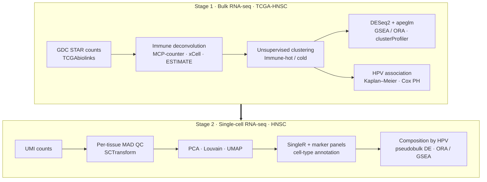

# Characterising Immune-hot and Immune-cold Tumour Microenvironment in Head and Neck Squamous Cell Carcinoma: Integrating TCGA Bulk RNA-Sequencing Immune Deconvolution with Single-Cell Transcriptomic Profiling


*MSc thesis analysis pipeline, written in R.* This page gives an overview of
the workflow and methods. The source code is kept in a private repository and
is available on request.

## Summary

Head and neck squamous cell carcinoma (HNSC) responds unevenly to
immunotherapy, and HPV-positive and HPV-negative tumours behave as clinically
distinct diseases. This pipeline classifies TCGA-HNSC tumours as
**immune-hot** or **immune-cold** using three immune-deconvolution methods,
then characterises the groups with differential expression, pathway
enrichment and survival analysis. A single-cell RNA-seq pipeline then
annotates cell types and compares the cellular composition and
cell-type-specific expression of HPV+ and HPV− tumours.

## Workflow



## Repository structure (private)

```
.
├── bulk_seq_analysis/          # Stage 1: bulk RNA-seq, run in numeric order
│   ├── 01_download_HNSC_TCGAbiolinks.R          # GDC download (STAR counts)
│   ├── 02_import_HNSC_clinical_2018.R           # clinical / HPV / survival import
│   ├── 03_run_immune_deconvolution.R            # MCP-counter, xCell, ESTIMATE
│   ├── 04_plot_immune_classification.R          # immune-hot / cold classification
│   ├── 05_plot_immune_scores_by_tool.R          # validation across tools
│   ├── 06_run_de_pathway_immune_hot_vs_cold.R   # DESeq2 + GO/KEGG ORA and GSEA
│   ├── 07_visualise_de_immune_hot_vs_cold.R     # volcano, heatmaps
│   ├── 08_correlate_genes_with_immunescore.R    # gene–immune score correlation
│   └── 09_clinical_association_immune_hot_vs_cold.R  # Fisher, KM, Cox PH
├── scRNA_analysis/             # Stage 2: single-cell RNA-seq
│   └── 01_run_scRNAseq_pipeline.R   # QC → SCTransform → clustering → annotation →
│                                    # HPV composition → pseudobulk DE → ORA / GSEA
└── renv.lock                   # pinned package versions
```

## Methods implemented

### Stage 1: Bulk RNA-seq (TCGA-HNSC)

| Step | Implementation | Rationale |
|---|---|---|
| Immune deconvolution | MCP-counter, xCell and ESTIMATE (immunedeconv) | Three independent estimates of immune infiltration |
| Immune groups | Clustering on deconvolution scores, with one tool held out | Keeps an independent method for validation |
| Differential expression | DESeq2 Wald test with apeglm LFC shrinkage | Shrinkage stabilises fold changes for low-count genes |
| Pathways | clusterProfiler ORA and GSEA (GO BP, KEGG) | GSEA catches coordinated sub-threshold shifts that ORA misses |
| Survival | Kaplan–Meier, log-rank, uni- and multivariable Cox PH | Tests whether the immune phenotype is prognostic independently of HPV |

### Stage 2: Single-cell RNA-seq

| Step | Implementation | Rationale |
|---|---|---|
| QC | 3 × MAD on log10 counts / genes / mito%, computed **per tissue type** | Library complexity differs by tissue, so one global cutoff would over- or under-filter |
| Normalisation | SCTransform v2 (glmGamPoi), regressing mito% | Removes sequencing-depth and mitochondrial technical variance |
| Clustering | PCA → shared-nearest-neighbour graph → Louvain → UMAP | PCs chosen from the elbow plot; checkpoints saved after expensive steps |
| Annotation | SingleR (celldex reference) + canonical marker panels | Combines reference-based labels with marker validation |
| Differential expression | Pseudobulk DESeq2 (counts summed per patient per cell type), then ORA / GSEA | Avoids pseudo-replication from treating cells of one patient as independent |

## Reproducibility practices

- Scripts numbered in run order, one analysis stage per script
- All paths relative to the project root, with no machine-specific paths
- Package versions pinned with [`renv`](https://rstudio.github.io/renv/)
- Checkpoints saved after expensive steps (SCTransform, clustering), so the
  pipeline can resume after a failure
- Raw data and outputs kept out of version control

## Access

The full source code is available on request.
