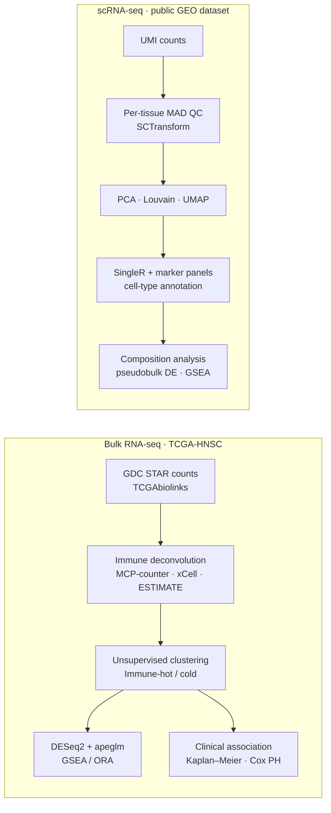

# Computational Biology MSc | Single-Cell & Bulk RNA-Seq Researcher

Recent Master's graduate specialised in **transcriptomics, cancer genomics, and
mathematical modelling** using R and Python. My MSc thesis built an end-to-end
R pipeline that integrates TCGA bulk RNA-seq with single-cell RNA-seq to study
the tumour immune microenvironment in head and neck cancer.

🎓 Currently applying for PhD positions in computational biology / cancer genomics.

## Skills

| Area | Tools |
|---|---|
| **Languages** | R, Python, Bash |
| **Single-cell RNA-seq** | Seurat (SCTransform, Louvain clustering, UMAP), SingleR, celldex, MAST, pseudobulk DE |
| **Bulk RNA-seq** | DESeq2 (apeglm shrinkage), TCGAbiolinks, GDC / cBioPortal data |
| **Tumour microenvironment** | immunedeconv: MCP-counter, xCell, ESTIMATE |
| **Pathway analysis** | clusterProfiler (GSEA, ORA), GO / KEGG, enrichplot |
| **Statistics & survival** | survival (Kaplan–Meier, Cox PH), k-means, non-parametric testing |
| **Visualisation** | ggplot2, pheatmap |
| **Reproducibility** | Git / GitHub, renv, Bioconductor, RStudio |

## MSc thesis project

**Characterising Immune-hot and Immune-cold Tumour Microenvironment in Head and
Neck Squamous Cell Carcinoma: Integrating TCGA Bulk RNA-Sequencing Immune
Deconvolution with Single-Cell Transcriptomic Profiling**

*The code is in a private repository, and access is available on request.*

### Workflow



### What I implemented

| Step | Implementation | Why |
|---|---|---|
| scRNA QC | 3 × MAD thresholds on log10 counts / genes / mito%, computed per tissue type | Library complexity differs by tissue, so a single global cutoff would mis-filter |
| Normalisation | SCTransform v2 (glmGamPoi), regressing mito% | Removes sequencing-depth and mitochondrial technical variance |
| Clustering & annotation | PCA → SNN graph → Louvain → UMAP; SingleR + canonical markers | Reference-based labels cross-checked with marker validation |
| Single-cell DE | Pseudobulk DESeq2 (counts summed per patient per cell type) | Avoids pseudo-replication from treating cells as independent samples |
| Bulk immune phenotyping | Three deconvolution tools, with one held out for independent validation | Guards against circular validation |
| Bulk DE & pathways | DESeq2 + apeglm shrinkage; clusterProfiler ORA and GSEA | GSEA captures coordinated sub-threshold shifts that ORA misses |
| Survival | Kaplan–Meier, log-rank, multivariable Cox PH | Tests independence from known clinical covariates |
| Reproducibility | Numbered scripts, relative paths, checkpointing, `renv` lockfile | Anyone can re-run the pipeline end-to-end |

### Code sample: tissue-aware QC (Seurat / dplyr)

```r
## Thresholds are computed per tissue type (3 x MAD on log10 scale) because
## library size/complexity differs systematically by tissue, so a single
## global cutoff would over- or under-filter some tissues.
mad_thresholds <- qc_metrics %>%
  group_by(tissuetype) %>%
  summarise(
    nCount_med   = median(log10_nCount),   nCount_mad   = mad(log10_nCount),
    nFeature_med = median(log10_nFeature), nFeature_mad = mad(log10_nFeature),
    mt_med       = median(log10_mt),       mt_mad       = mad(log10_mt),
    .groups = "drop"
  ) %>%
  mutate(
    nCount_lower   = nCount_med   - 3 * nCount_mad,
    nCount_upper   = nCount_med   + 3 * nCount_mad,
    nFeature_lower = nFeature_med - 3 * nFeature_mad,
    nFeature_upper = nFeature_med + 3 * nFeature_mad,
    # Mito%: only high values indicate dying cells, so upper bound only
    mt_upper       = mt_med + 3 * mt_mad
  )
```

## Contact

Full thesis code and results are available on request; contact details are
on my CV.
